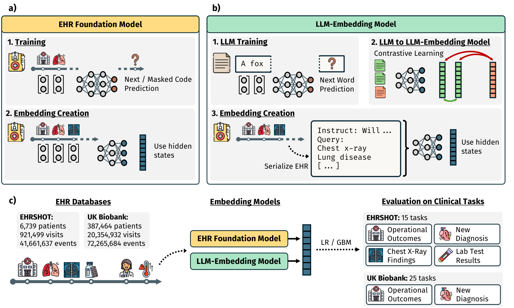
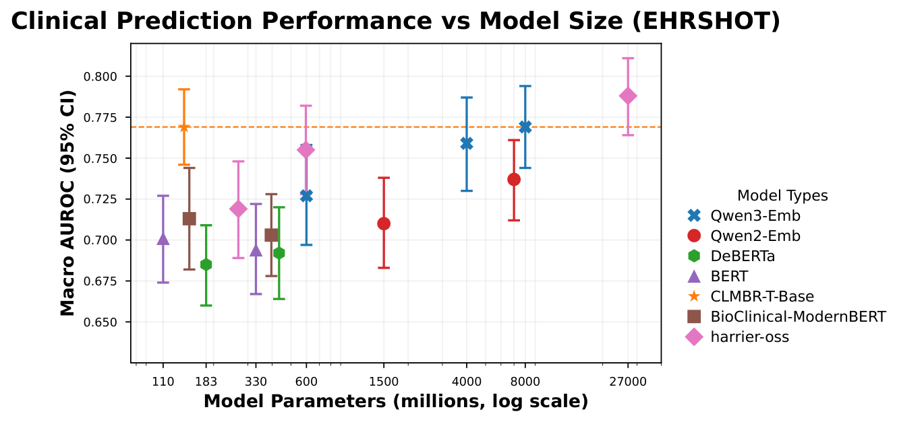

<div align="center">
  <h1>Large Language Models are Powerful Electronic Health Record Encoders</h1>
  <h4>
    <a href="https://www.nature.com/articles/s41746-026-02915-9">📝 Paper (npj Digital Medicine)</a> •
    <a href="https://redivis.com/datasets/53gc-8rhx41kgt">🗃️ EHRSHOT Dataset</a> •
    <a href="https://huggingface.co/StanfordShahLab/clmbr-t-base">🔮 CLMBR-T-Base</a> •
    <a href="https://github.com/som-shahlab/ehrshot-benchmark">🔗 Upstream EHRSHOT</a>
  </h4>
  <p>Serialize EHRs into plain text, embed them with general-purpose LLMs, and match a specialized EHR foundation model on clinical prediction without private medical pretraining data.</p>
</div>

---

This repository contains the code for [Large language models are powerful electronic health record encoders](https://www.nature.com/articles/s41746-026-02915-9).

It is a fork of the [EHRSHOT benchmark](https://github.com/som-shahlab/ehrshot-benchmark), and most of the pipeline, data handling, and baseline code is theirs. We kept the original code as unchanged as possible.

<div align="center">
  
  <p><em>Figure 1. EHR records are serialized to text and embedded by a general-purpose LLM. A simple classifier is then trained per task and compared against the CLMBR-T-Base EHR foundation model and count-based baselines.</em></p>
</div>

## Our additions to EHRSHOT

The core addition is a new feature-generation step, [`4_generate_llm_features.py`](ehrshot/4_generate_llm_features.py), that produces **LLM embedding representations** of the serialized EHR. This is the direct analogue of the existing count- and CLMBR-based features, so the rest of the EHRSHOT pipeline (few-shot sampling, evaluation, plotting) is reused unchanged. The main new components are:

- [`llm_featurizer.py`](ehrshot/llm_featurizer.py): the `LLMFeaturizer` that turns each patient timeline into a serialized record and aligns it with the benchmark labels.
- [`serialization/ehr_serializer.py`](ehrshot/serialization/ehr_serializer.py) and [`ehr_simple_serializer.py`](ehrshot/serialization/ehr_simple_serializer.py): the EHR-to-text serializers behind the different serialization strategies (list of recent codes, first occurrence, with or without time, and Markdown, JSON, XML, and YAML formats), selected via [`ehr_serializer_factory.py`](ehrshot/serialization/ehr_serializer_factory.py). Task instructions live in [`serialization/task_to_instructions_list.json`](ehrshot/serialization/task_to_instructions_list.json).
- [`serialization/text_encoder.py`](ehrshot/serialization/text_encoder.py): the `TextEncoder` and encoder classes that wrap each LLM embedding model (Qwen3-Embedding, GTE-Qwen2, LLM2Vec-Llama, the BERT-family baselines, and the newly added models below).

We also added steps for the **fine-tuning and in-context-learning experiments** and for **external validation on the UK Biobank** (in [`UKB_validation/`](UKB_validation/)). Both are described in their own sections below.

## Configuration

All machine-specific paths and conda environments are read from a repo-root `.env` file. Copy the template and fill it in. The pipeline and launch scripts source it.

```bash
cp .env_template .env
# then set EHRSHOT_BENCHMARK_DIR, HUGGINGFACE_CACHE, the conda env names,
# and (for external validation) the UKB_* paths.
```

## Reproduce main experiments

1. **Set up the environment, install FEMR, and download the EHRSHOT dataset** by following the [upstream EHRSHOT instructions](README_EHRSHOT_NEW.md#-quick-start). Place the data under `EHRSHOT_ASSETS/`.
2. **Install the LLM dependencies** from `requirements.txt` (pinned for our main experiments with Qwen3-Emb). LLM2Vec-Llama3.1 needs a separate, incompatible dependency set, so use a dedicated env for it.
3. **Reproduce the original EHRSHOT baselines** with `bash run_all.sh`, as described upstream. We copied the data and results of this baseline run into `EHRSHOT_ASSETS_BASELINES/` to keep them separate from the LLM experiments.
4. **Run the LLM embedding experiments.** Use a fresh `EHRSHOT_ASSETS/` for these and add all EHRSHOT dataset files, then run the main entry point:

   ```bash
   cd ehrshot/bash_scripts
   bash run_experiments.sh              # add --is_use_slurm to submit as SLURM jobs
   ```

   The default configuration is **Qwen3-Emb-8B** with the **`unique_codes_list_recent_8k`** serialization. Uncomment entries in the `text_encoders` and `serialization_strategies` lists in [`run_experiments.sh`](ehrshot/bash_scripts/run_experiments.sh) to run other models (all Qwen3, Qwen2, and BERT variants, plus the two new model families below) and serializations. Each config runs `4_generate_llm_features.py` and then the standard evaluation, mirroring the count and CLMBR pipeline.
5. **Combine results and make figures** with the helper scripts, for example [`8_make_results_plots.py`](ehrshot/8_make_results_plots.py), [`12_merge_and_plot_revision_results.py`](ehrshot/12_merge_and_plot_revision_results.py), and [`helper/create_plots.ipynb`](ehrshot/helper/create_plots.ipynb) for the scaling and ablation figures.

> **Runtime note.** Preprocessing (serializing all EHRs into text) is relatively slow and takes about 1 to 3 hours depending on hardware. Our setup regenerates the serialization for every run. If the same serialization is reused across experiments, caching it would save this cost.

## Custom vocabularies

During serialization, some medical codes are resolved to natural-language text using vocabulary files in [`ehrshot/custom_ontologies/`](ehrshot/custom_ontologies/). The CVX and ICD-10-PCS (PClassR) files are included in the repository. The CPT4 file is not redistributed here, so download it from the source below and save it as `ehrshot/custom_ontologies/cpt4.csv`. All sources are also listed in that folder's `Readme.md`.

- CPT4 (download and place at `ehrshot/custom_ontologies/cpt4.csv`): https://gist.github.com/lieldulev/439793dc3c5a6613b661c33d71fdd185
- ICD-10-PCS (PClassR): https://hcup-us.ahrq.gov/toolssoftware/procedureicd10/procedure_icd10%20_archive.jsp
- CVX: https://www2a.cdc.gov/vaccines/iis/iisstandards/vaccines.asp?rpt=cvx

## Fine-tuning and in-context learning

Beyond the frozen embedding plus classifier setup, we evaluate LoRA fine-tuning and decoder in-context learning (ICL). For any run, few-shot adaptation is either in-context examples or LoRA fine-tuning, never both. From `ehrshot/bash_scripts/`:

- **Hyperparameter search:** `11_tune_finetuning_params.py` (`--plan-only`, then `sbatch --array`, then `--collect-only`) over the grid in `ehrshot/configs/tuning_grid.yaml`, followed by `select_best_params.py`.
- **Single fine-tune and eval:** `10a_fit_and_eval_encoder.py` (Qwen3-Emb-8B + LoRA) and `10b_fit_and_eval_decoder.py` (Qwen3-8B + LoRA), run over `(task, k, replicate)`.
- **Decoder ICL:** `10b_fit_and_eval_decoder.py --icl_shots {0,2,4,6}` (finetuning-free, use `--batch_size 1` for long context).
- **Merge and plot:** `12_merge_and_plot_revision_results.py`.

The frozen winning configs are committed under [`ehrshot/configs/`](ehrshot/configs/) (`best_params_encoder.json`, `best_params_decoder.json`). Neither fine-tuned variant surpassed the frozen Qwen3-Emb-8B baseline within the explored budgets.

> **Note.** These scripts were refactored from the distributed pipeline we used for the actual runs (a Snakemake orchestration for scheduling and running the jobs) into plain scripts. The result is cleaner but was not executed in exactly this form, so new issues may have been introduced. Please open a GitHub Issue if you hit one and we are happy to help resolve it.

## External validation on the UK Biobank

Code for the UK Biobank external validation is in [`UKB_validation/`](UKB_validation/). It reuses the same list-based serialization (omitting units and values, which UKB lacks) and compares the LLM embedding model against CLMBR-T-Base, including the sensitivity analysis that restricts the LLM to CLMBR-mappable codes. Configure the `UKB_*` paths in `.env` assuming a local copy of the UK Biobank data.

## Additional results: BioClinical ModernBERT and harrier-oss-v1

After acceptance we added two further embedding-model families:

- **BioClinical ModernBERT:** [base](https://huggingface.co/thomas-sounack/BioClinical-ModernBERT-base) and [large](https://huggingface.co/thomas-sounack/BioClinical-ModernBERT-large), with native 8192-token context and mean pooling.
- **harrier-oss-v1:** [270m](https://huggingface.co/microsoft/harrier-oss-v1-270m), [0.6b](https://huggingface.co/microsoft/harrier-oss-v1-0.6b), and [27b](https://huggingface.co/microsoft/harrier-oss-v1-27b), instruction-tuned with last-token pooling and L2 normalization.

Both are integrated as standard encoders in [`serialization/text_encoder.py`](ehrshot/serialization/text_encoder.py) and run from `run_experiments.sh` (keys `bioclinical_modernbert_{base,large}` and `harrier_oss_{270m,0_6b,27b}`). The extended scaling plot below places them alongside the models from the paper. harrier-oss-v1-27b reaches the highest macro-AUROC of all tested models.

<div align="center">
  
  <p><em>Extended scaling results including BioClinical ModernBERT and harrier-oss-v1 (see <code>artifacts/figure_scaling_extended.png</code>).</em></p>
</div>

## Citation

If you use this code, please cite our paper:

```bibtex
@article{Hegselmann2026llm,
  title   = {Large language models are powerful electronic health record encoders},
  author  = {Hegselmann, Stefan and von Arnim, Georg and Rheude, Tillmann and Kronenberg, Noel and Sontag, David and Hindricks, Gerhard and Eils, Roland and Wild, Benjamin},
  journal = {npj Digital Medicine},
  year    = {2026},
  volume  = {9},
  issn    = {2398-6352},
  doi     = {10.1038/s41746-026-02915-9},
  url     = {https://doi.org/10.1038/s41746-026-02915-9}
}
```

Please also cite the original EHRSHOT benchmark this work builds on:

```bibtex
@article{wornow2023ehrshot,
      title={EHRSHOT: An EHR Benchmark for Few-Shot Evaluation of Foundation Models}, 
      author={Michael Wornow and Rahul Thapa and Ethan Steinberg and Jason Fries and Nigam Shah},
      year={2023},
      eprint={2307.02028},
      archivePrefix={arXiv},
      primaryClass={cs.LG}
}
```

## License

The source code in this repository is released under the Apache License 2.0, following the upstream EHRSHOT repository. The EHRSHOT dataset and the CLMBR-T-Base model have their own licenses, listed on their respective pages.
